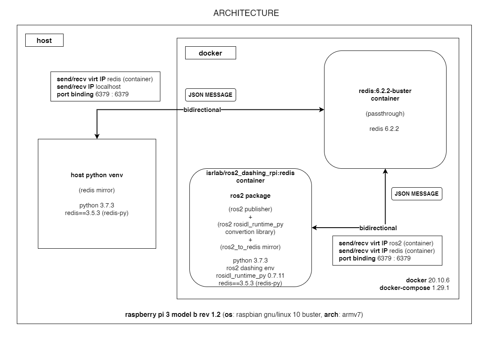

##### message translation example (from ros2 to non-ros2)

##### architecture diagram



##### [ros2 container] publisher module

###### api call example

```python
turlebot.go_back()
```

##### [ros2 container] rosidl_runtime_py conversion module

###### (step 1) ros2 custom interface -> python collections.OrderedDict

```
geometry_msgs.msg.Twist(linear=geometry_msgs.msg.Vector3(x=-0.1, y=0.0, z=0.0), angular=geometry_msgs.msg.Vector3(x=0.0, y=0.0, z=0.0))
```

```python
OrderedDict([('linear', OrderedDict([('x', -0.1), ('y', 0.0), ('z', 0.0)])), ('angular', OrderedDict([('x', 0.0), ('y', 0.0), ('z', 0.0)]))])
```

###### (step 2) python collections.OrderedDict -> json

```python
OrderedDict([('linear', OrderedDict([('x', -0.1), ('y', 0.0), ('z', 0.0)])), ('angular', OrderedDict([('x', 0.0), ('y', 0.0), ('z', 0.0)]))])
```

```json
{"linear": {"x": -0.1, "y": 0.0, "z": 0.0}, "angular": {"x": 0.0, "y": 0.0, "z": 0.0}}
```

##### [ros2 container] redis mirror module

```
(receives and sends the json message)
(requires a redis middleware container, redis server)
(uses the redis-py client library)

from: ros2 container
  to: host, raspberry
port: 6379, default
```

##### [redis middleware container]

```
(middleware, redis server)
(simple message passthrough)

from: ros2 container
  to: host, raspberry
port: 6379, default
```

##### [host: raspberry] redis mirror module

```
(receives the json message)
(uses the redis-py client library)
```

##### [important!]

###### this whole process works bidirectionally (also from non-ros2 to ros2, always using json messages)
